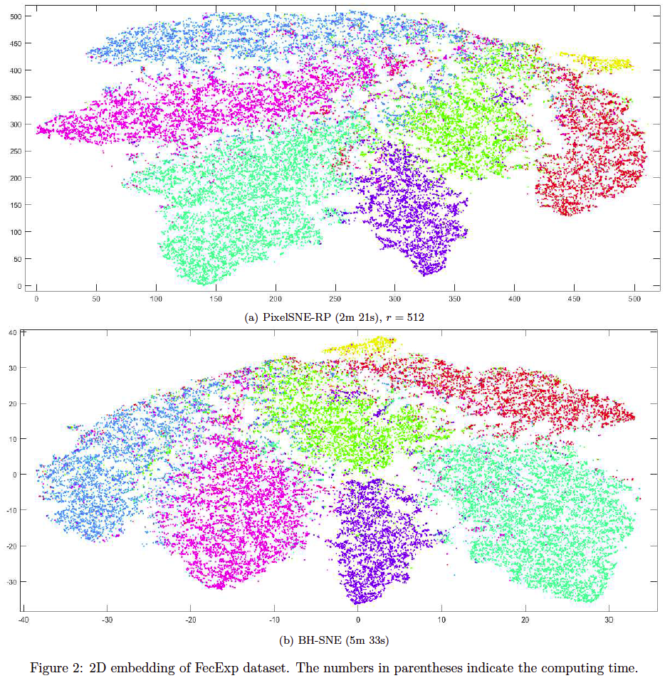
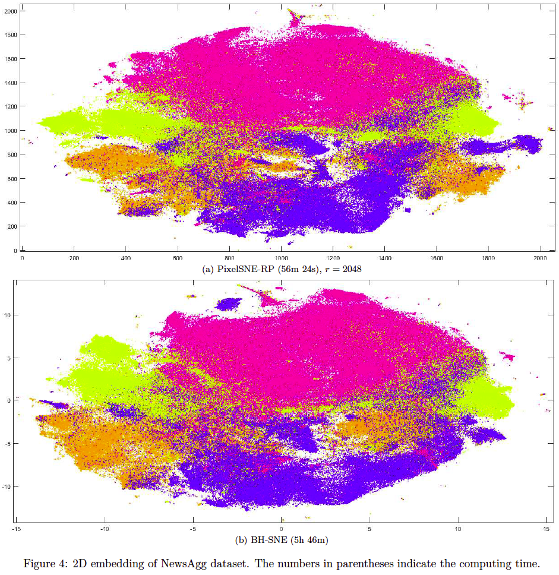
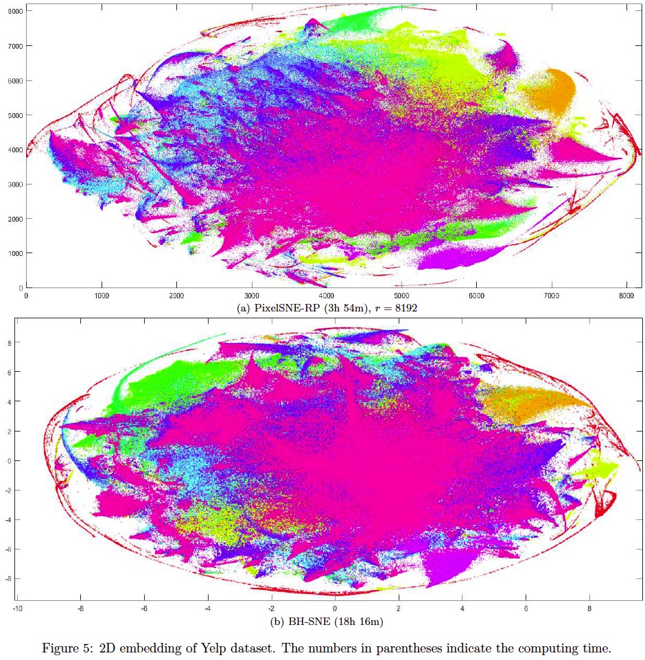

# Installation #

On Linux or OS X, compile the source using the following command:

```
sudo g++ ptree.cpp pixelsne.cpp LargeVis.cpp -o pixelsne -O2 -I /usr/include/boost -lboost_thread -lboost_system -lm -pthread -lgsl -lgslcblas -Ofast -march=native -ffast-math
```

The executable will be called `pixelsne`.

# Usage #

The code comes with wrappers for Matlab. These wrappers write your data to a file called `data.dat`, run the `pixelsne` binary, and read the result file `result.dat` that the binary produces. 

Demonstration of usage in Matlab:

```matlab
load(filename);
numDims = 2; pcaDims = 50; perplexity = 50; theta = .5; alg = 'svd'; p_method = 0; bins = 512;
map=fast_pixelsne(digits', numDims, pcaDims, perplexity, theta, alg, p_method, bins);
gscatter(map(:,1), map(:,2), labels');
```

# Results #








